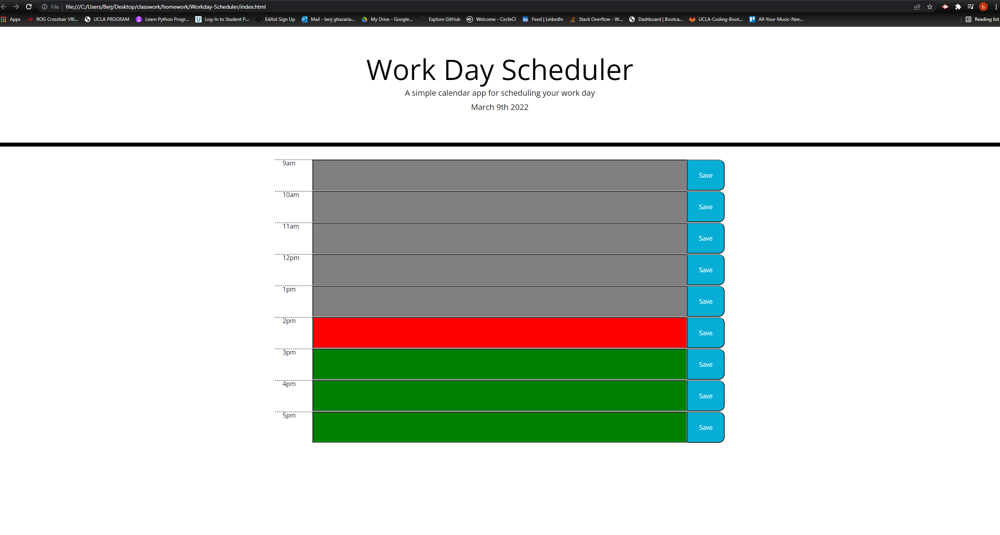

# Workday-Scheduler

## Description
This is a schedule planner for any user to save whatever it is they need to do throughout the day. Upon saving, the user will have the information saved even after refresh until it is deleted. As for the coloring, red would be the present time and green is upcoming.

## Technologies Used
- HTML 
- CSS
- JAVASCRIPT
- MOMENT.JS

## Links
https://github.com/BerjGhazarian/Workday-Scheduler

https://berjghazarian.github.io/Workday-Scheduler/

## Image
